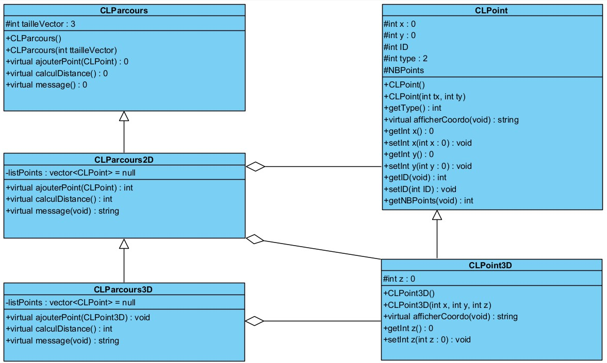

# prosit3

## Use case diagram 

## Class diagram

## Sequence diagram

### commits explanation:
On the creation of the repository, the two points classes were functionnal
On the first commit, we added the parcours classes and everything worked smoothly
This third commit is creating the readme.
